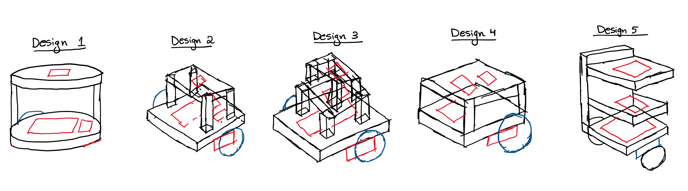
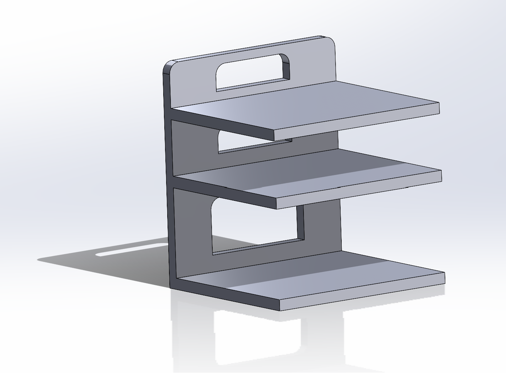
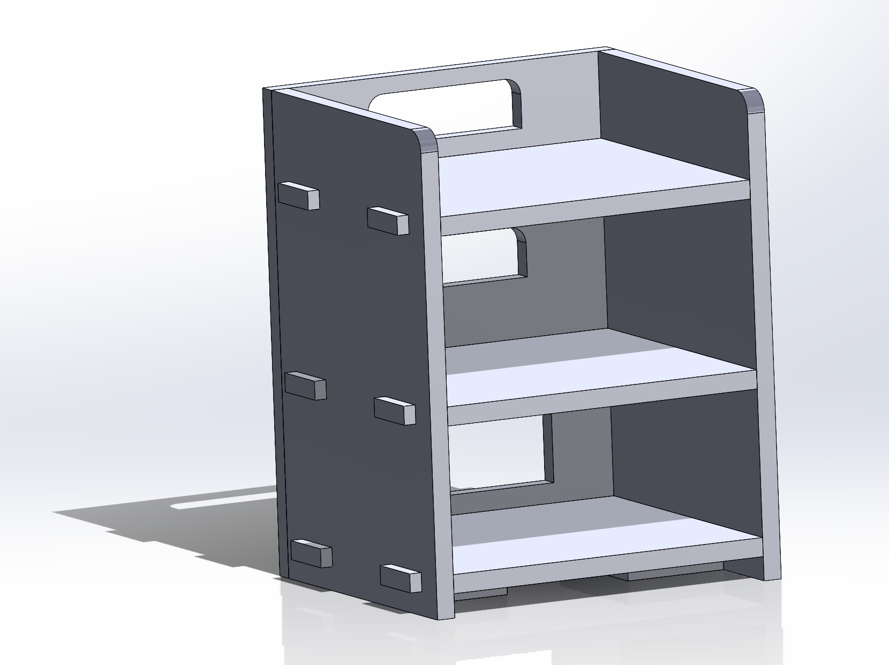
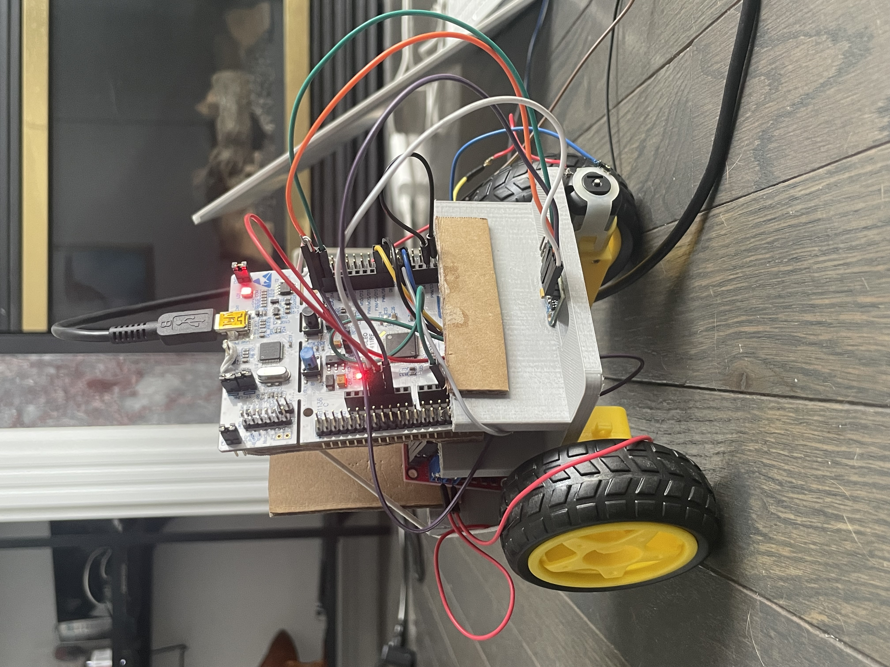
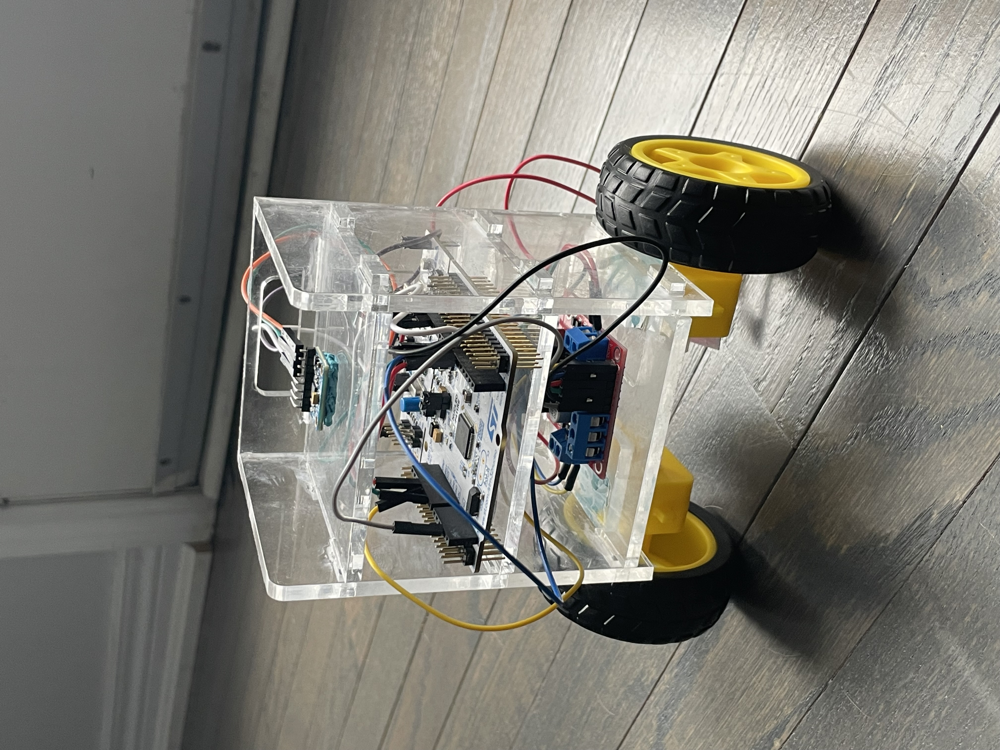

# GyroBot - Self Balancing Robot 

A self balancing robot programmed on the STM32! It uses a L298N motor driver to control the
motors and a 6-axis IMU to capture gyroscope and accelerometer readings. It is programmed using 
a state machine and combined with a PID controller to maintain robot stability.

## Design Process

## Modelling

  
  

## Control Logic

  

## Results

  
  

## Next Steps
- Add bluetooth control to the robot
- Add a Kalman or a complementary filter that fuses gyroscope and accelerometer readings for better pitch accuracy