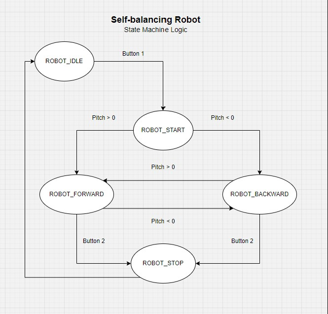

# GyroBot - Self Balancing Robot 

A self balancing robot programmed on the STM32! It uses a 6-axis IMU to capture
gyroscope and accelerometer readings. It is programmed using a state machine and combined
with a PID controller to maintain robot stability. Note, the robot uses a L298N motor driver 
to control the motors.

## Design Process

## Modelling

## Control Logic
